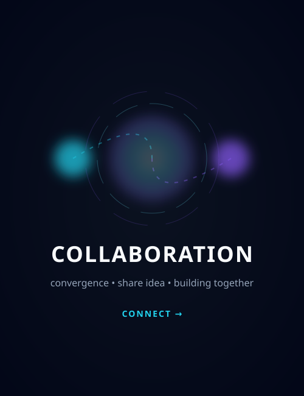

<!--<h1 align="center" style="font-size: 50px;">Hi! 👋 I'm Mahadi Hasan</h1>-->

    

### 🚀 **About me**

I'm a full-stack developer currently working as a Software Engineer at **$\color{#FFA500}{\text{DEVSNEST LLC}}$**, where I've spent over a year building and maintaining robust Shopify apps & Next.js projects. I specialize in the **React** and **Node.js** ecosystems, building with tools like **Next.js**, **TypeScript**, **Express**, **Elysia.js**, and **Tailwind CSS**. On the database side, I have strong experience with **MongoDB** and **Mongoose**. I'm always excited to explore new tech and build applications that make an impact. I love building user-friendly, scalable, and interactive web applications that deliver exceptional user experiences.

 
<!-- and right now, I'm really enjoying learning **Python**, **PostgreSQL** and **Prisma** to expand my skill set. -->

### 🌱 **What I'm Currently Up To**
<!-- divider  -->

- 🔥 Learning **Full Stack development** at **Programming Hero Level Two**.
- 📚 I'm currently exploring **Python**, **PostgreSQL** and **Prisma** to expand my backend skill set.
- 💡 Exploring **full-stack development** and backend technologies like **Node.js** and **Express.js**.
- 🎯 Goal: Become a Full-Stack Developer by 2026
- 👀 Actively seeking my next adventure as a Full Stack developer!

 
<!-- https://img.shields.io/badge/Shopify%20App-E10098?logo=shopify&logoColor=white -->

### 🛠️ **Tech Stack** *(Evolving)*
<!-- divider  -->

| **Category**       | **Skills/Tools**                                                                                     |
|---------------------|-----------------------------------------------------------------------------------------------------|
| **Languages**       |   |
| **Frontend**        |         |
| **Backend**         |      |
| **Tools**           |        |
| **Exploring**           |     |
| **Others**           |  |
| **Expertise**       | 🧩 **Problem Solving** • 🚀 **Quick Learner** • 📊 **Shopify** (App development & Customization)            |

### 📊 My GitHub Stats
<!-- Divider -->

  

  

### 📈 Statistics
<!-- Divider  -->

  
  
  
  

<!--  -->

<!-- Collaboration part start  -->

<table width="100%" border="0" cellspacing="10" cellpadding="0">
<tr>

<!-- LEFT: COLLAB -->
<td width="33%" valign="top">

<h2>🤝 Collaboration</h2>

I’m open to collaborating on:

<ul>
  <li><strong>Scalable Full-Stack Systems</strong></li>
  <li><strong>High-Performance Frontends task</strong></li>
  <li><strong>MERN Stack web application</strong></li>
  <li><strong>Custom Shopify Apps</strong></li>
  <li><strong>Freelance & Startup Projects</strong></li>
</ul>

</td>

<!-- MIDDLE: PANEL -->
<td width="34%" align="center" valign="middle">
    
</td>

<!-- RIGHT: CONTACT -->
<td width="33%" valign="top" align="center">

<h2>📫 Contact</h2>

 

  

  

<!-- Or contact with  -->
<!-- Divider  -->

  &nbsp;&nbsp;&nbsp;
  &nbsp;&nbsp;&nbsp;
  &nbsp;&nbsp;&nbsp;
  

</td>

</tr>
</table>

<!-- Collaboration part start  -->

<!--  -->

<!-- 

 -->

### 📫 Let’s connect, innovate together! 👨‍💻
<!-- divider  -->

- **Email**: [mehedihasanmilu7@gmail.com](mailto:mehedihasanmilu@gmail.com)
- **LinkedIn**: [https://www.linkedin.com/in/withmahadi](https://www.linkedin.com/in/withmahadi)

  

